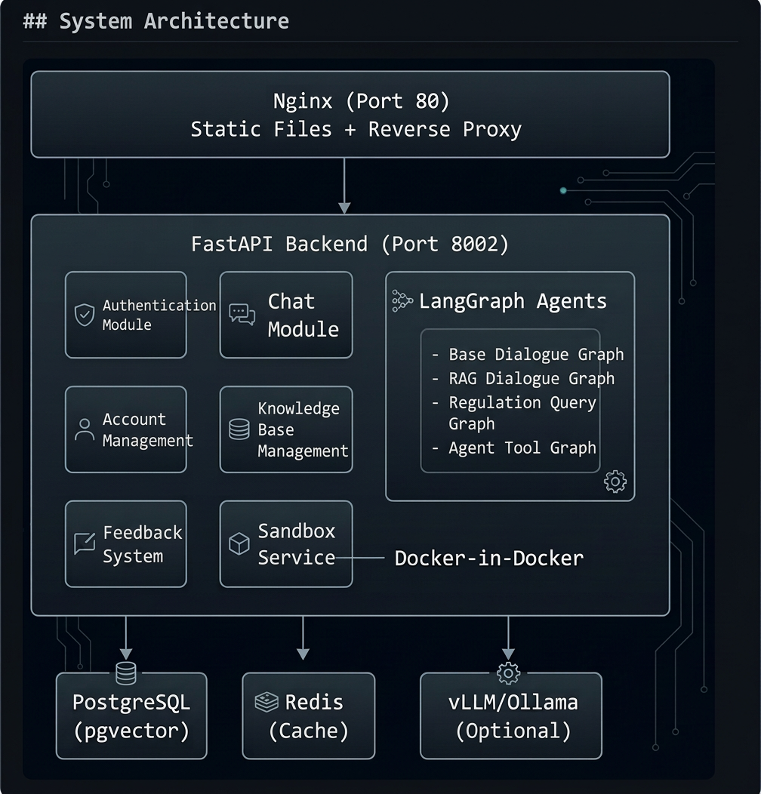

<p align="center">
  <h1 align="center">Metora</h1>
  <p align="center">
    <em>Where AI Agents Finally Land</em>
  </p>
</p>

<p align="center">
  <a href="https://github.com/wuwushi4/metora/stargazers"></a>
</p>

<p align="center">
  <a href="./LICENSE"></a>
  
  
  
  
  
</p>

<p align="center">
  <a href="./README.md">English</a> |
  <a href="./README_zh-TW.md">繁體中文</a>
</p>

<!--
<p align="center">
  
</p>
-->

---

> Most AI agent projects today are like meteors —
> they shine brightly for a moment, but burn out before reaching the ground.
>
> **Metora is different. It helps AI agents actually land inside real teams.**

Metora is an open-source, self-hosted platform for deploying and managing AI agents — designed for teams and small organizations, not just demos.

- 🤖 **4 Agent Types** — Chat, RAG assistant, legal assistant, tool agent with sandboxed execution
- 📚 **Knowledge Base** — PDF, DOCX upload with hybrid retrieval (Vector + BM25 + RRF + Reranker)
- 🧠 **Prompt Templates** — Personal prompt library for reuse
- 🧑‍🤝‍🧑 **Team-ready** — Built-in user management, roles, and permissions
- 🛠 **Sandbox Execution** — Docker-isolated Python for tool agents
- 💬 **Chat History** — Persistent conversations with search
- 🔍 **Feedback Tracking** — Rate AI responses, track quality over time
- 📊 **Dashboard & Monitoring** — Usage analytics with Grafana integration
- 📱 **PWA Support** — Installable as a progressive web app

## Quick Start

> Prerequisites: Docker & Docker Compose.
> Optional: NVIDIA GPU + NVIDIA Container Toolkit for local model inference.

```bash
git clone https://github.com/wuwushi4/metora.git
cd metora
cp .env.example .env    # Set your LLM provider, DB credentials, JWT secret
docker compose -f docker-compose.dev.yml up -d    # Cloud LLM (remember to set LLM_PROVIDER to your cloud LLM provider)
```

Visit **http://localhost** and log in with `admin` / `admin123` (default credentials — change immediately in production).

<details>
<summary>Additional setup options</summary>

```bash
# Use local vLLM inference (recommended model: Qwen3.5)
docker compose -f docker-compose.dev.yml --profile local-llm up -d

# Build sandbox image (required for Tool Agent)
cd backend/sandbox
docker build -t metora-sandbox:latest .
```

| Service | URL |
|---------|-----|
| Web UI | http://localhost |
| API Docs | http://localhost:8002/docs |

</details>

## Multi-Agent System

| Agent Type | Description | Use Case |
|-----------|-------------|----------|
| **General Chat** | Direct LLM conversation with multi-turn context | Daily Q&A, brainstorming |
| **RAG Secretary** | Knowledge-base powered assistant with hybrid retrieval | Internal docs search, company knowledge Q&A |
| **Legal Assistant** | Specialized for regulation lookup with article-level precision | Legal compliance, regulation interpretation |
| **Tool Agent** | Autonomous agent with sandboxed Python execution (Docker isolated) | Data analysis, report generation, complex tasks |

## Architecture

<p align="center">
  
</p>

### Tech Stack

| Layer | Technology |
|-------|-----------|
| **Frontend** | Vue 3, TypeScript, Vite, Naive UI, Tailwind CSS, Pinia |
| **Backend** | Python, FastAPI, LangGraph 1.0, LangChain 1.0 |
| **Database** | PostgreSQL (pgvector), Redis |
| **Retrieval** | BGE Embeddings, BM25, RRF Fusion, BGE Reranker |
| **Inference** | vLLM, Ollama, OpenAI API, Azure OpenAI, Google Gemini |
| **Deployment** | Docker Compose, Nginx |
| **Monitoring** | Grafana |

## Supported LLMs

| Provider | Models | Local/Cloud |
|----------|--------|-------------|
| **vLLM** | Any HuggingFace model (e.g., Qwen, Llama, Mistral) | Local |
| **Ollama** | All Ollama models | Local |
| **OpenAI** | GPT-4o, GPT-4, GPT-3.5, etc. | Cloud |
| **Azure OpenAI** | All Azure-deployed models | Cloud |
| **Google Gemini** | Gemini 2.0 Flash, Gemini Pro, etc. | Cloud |

> 💡 **Local deployment recommendation:** We suggest using **Qwen3.5** with **vLLM** as the inference engine for the best balance of performance and quality.

## Roadmap

- [ ] i18n — Multi-language UI support (English / Chinese)
- [ ] More agent types (Deep Research, Web Search)
- [ ] Multi-tenant support
- [ ] SSO integration (LDAP, OAuth 2.0)
- [ ] API key management for external integrations
- [ ] Mobile-optimized UI

## Contributing

We welcome contributions! Please see [CONTRIBUTING.md](./CONTRIBUTING.md) for guidelines.

## License

This project is licensed under the [Apache License 2.0](./LICENSE).

---

<p align="center">
  If you find Metora useful, please consider giving it a ⭐
</p>

<p align="center">
  <a href="https://github.com/wuwushi4/metora/stargazers"></a>
</p>
