<p align="center">
  <h1 align="center">Metora</h1>
  <p align="center">
    <em>Where AI Agents Finally Land</em>
  </p>
</p>

<p align="center">
  <a href="https://github.com/wuwushi4/metora/stargazers"></a>
</p>

<p align="center">
  <a href="./LICENSE"></a>
  
  
  
  
  
</p>

<p align="center">
  <a href="./README.md">English</a> |
  <a href="./README_zh-TW.md">繁體中文</a>
</p>

---

> 大多數 AI Agent 專案就像流星 ——
> 閃耀一瞬，卻在落地前燃燒殆盡。
>
> **Metora 為落地而生。** 它讓 AI Agent 真正進入團隊的日常工作中。

Metora 是一個開源、可自架的多 Agent AI 平台 —— 專為團隊與中小企業設計，不只是 Demo。

- 🤖 **4 種 Agent 類型** — 通用聊天、RAG 秘書、法規助理、工具型 Agent（沙箱執行）
- 📚 **知識庫管理** — 上傳 PDF、DOCX，混合檢索（向量 + BM25 + RRF 融合 + BGE 重排序）
- 🧠 **提示詞模版** — 個人提示詞模版庫，重複使用
- 🧑‍🤝‍🧑 **團隊就緒** — 內建帳號管理、角色與權限控制
- 🛠 **沙箱執行** — Docker 隔離的 Python 環境，供工具 Agent 使用
- 💬 **聊天紀錄** — 完整對話持久化與搜尋
- 🔍 **反饋追蹤** — 對 AI 回應評分，持續追蹤品質
- 📊 **儀表板與監控** — 使用量分析，內建 Grafana 整合
- 📱 **PWA 支援** — 可安裝為漸進式網路應用程式

## 快速開始

> 前置條件：Docker & Docker Compose。
> 可選：NVIDIA GPU + NVIDIA Container Toolkit（用於本地模型推論）。

```bash
git clone https://github.com/wuwushi4/metora.git
cd metora
cp .env.example .env    # 設定 LLM 供應商、資料庫憑證及 JWT 密鑰
docker compose -f docker-compose.dev.yml up -d    # 雲端 LLM (LLM_PROVIDER 記得調整為雲端LLM供應商)
```

開啟 **http://localhost**，以 `admin` / `admin123` 登入（此為預設密碼，正式環境請立即修改）。

<details>
<summary>更多部署選項</summary>

```bash
# 使用本地 vLLM 推論（推薦模型：Qwen3.5）
docker compose -f docker-compose.dev.yml --profile local-llm up -d

# 建置沙箱映像（工具 Agent 需要）
cd backend/sandbox
docker build -t metora-sandbox:latest .
```

| 服務 | 網址 |
|------|------|
| 網頁介面 | http://localhost |
| API 文件 | http://localhost:8002/docs |

</details>

## 多 Agent 系統

| Agent 類型 | 說明 | 使用場景 |
|-----------|------|---------|
| **通用聊天** | 直接與 LLM 對話，支援多輪上下文 | 日常問答、腦力激盪 |
| **RAG 秘書** | 基於知識庫的智慧助理，混合檢索 | 內部文件搜尋、企業知識問答 |
| **法規助理** | 法規條文精準查詢與情境分析 | 法規遵循、條文解釋 |
| **工具 Agent** | 自主 Agent，支援沙箱 Python 執行（Docker 隔離） | 資料分析、報表生成、複雜任務 |

## 功能展示

### 儀表板
<p align="center">
  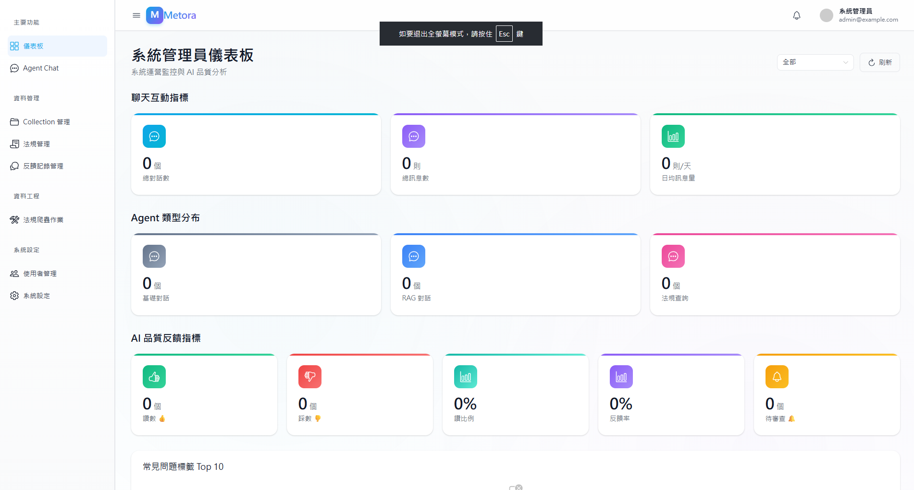
</p>

### 多 Agent 系統
<p align="center">
  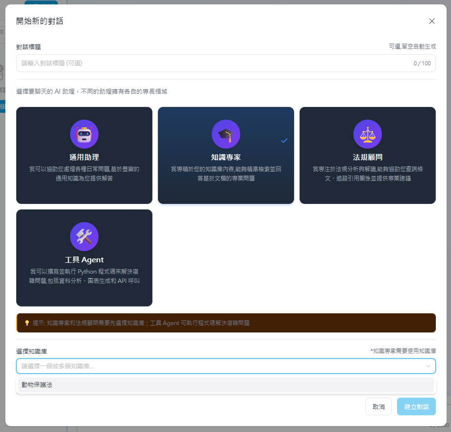
</p>

#### RAG 秘書 — 知識庫檢索與來源引用
<p align="center">
  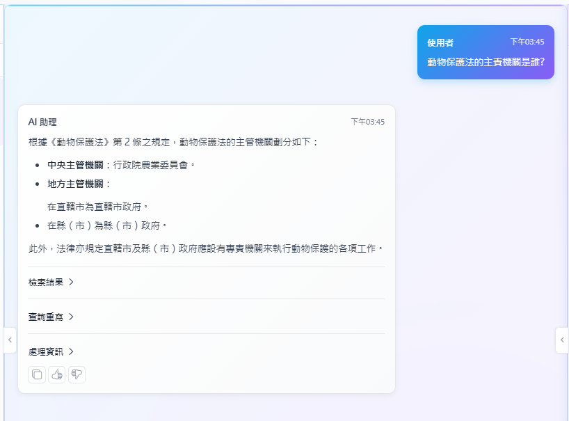
</p>
<p align="center">
  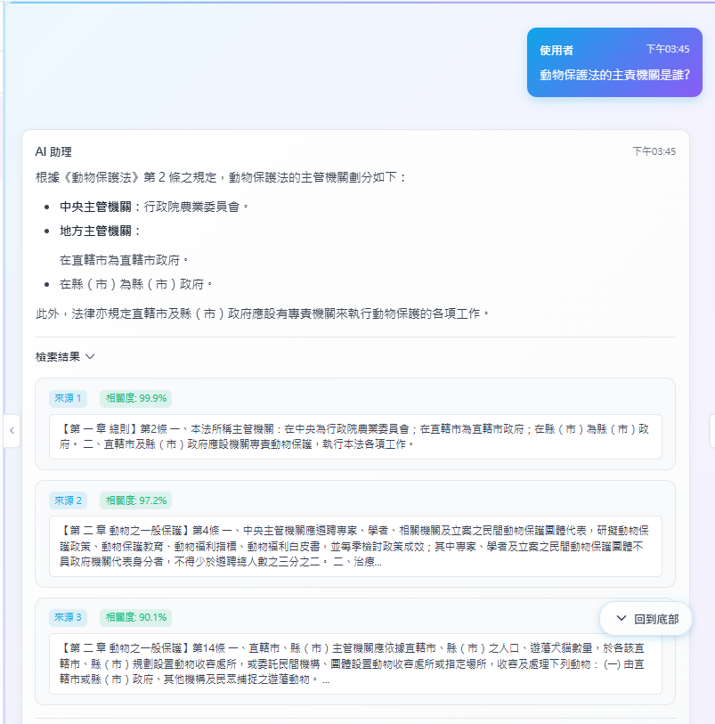
</p>

#### 工具 Agent — 沙箱程式碼執行與圖表生成
<p align="center">
  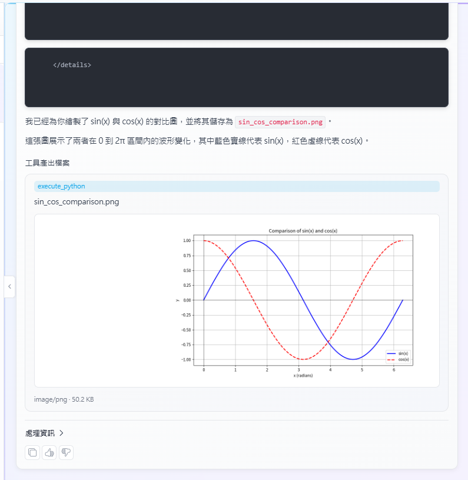
</p>

### 提示詞模版
<p align="center">
  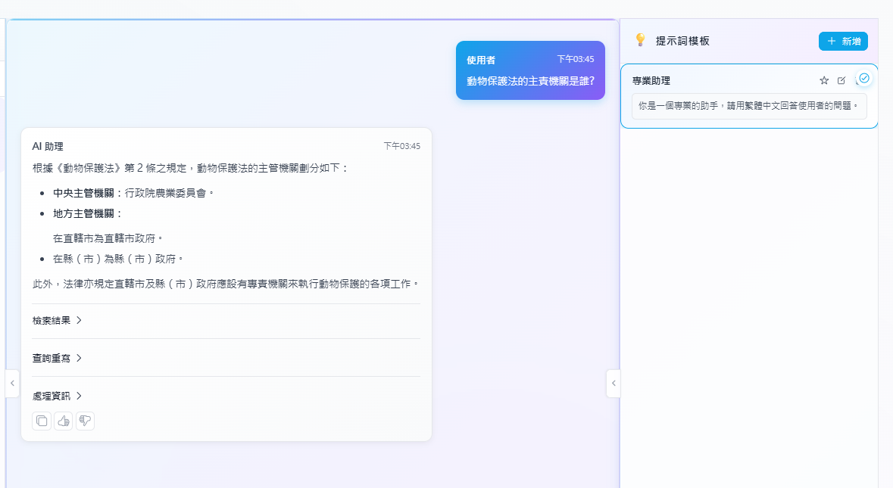
</p>

### 知識庫管理
<p align="center">
  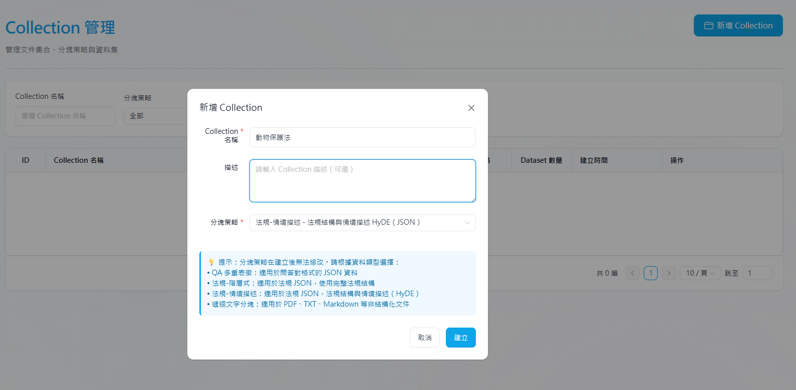
</p>

### 法規管理
<p align="center">
  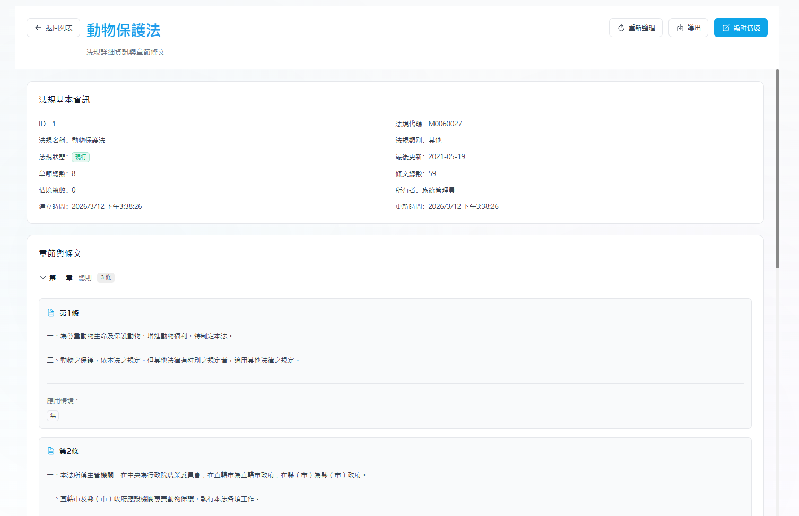
</p>

### 反饋與品質追蹤
<p align="center">
  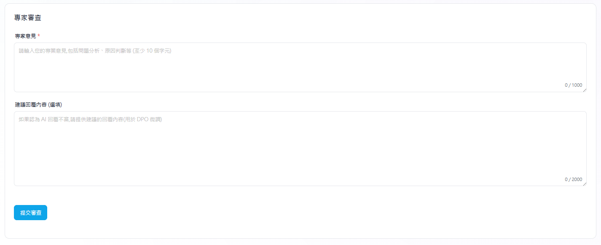
</p>

### 使用者管理
<p align="center">
  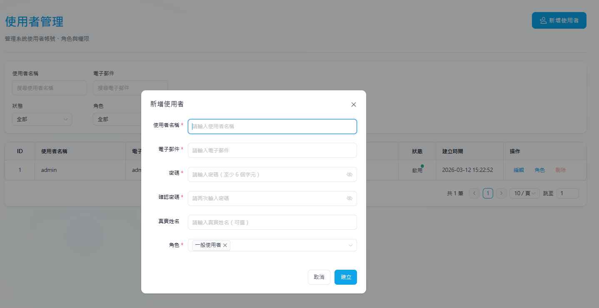
</p>

## 系統架構

<p align="center">
  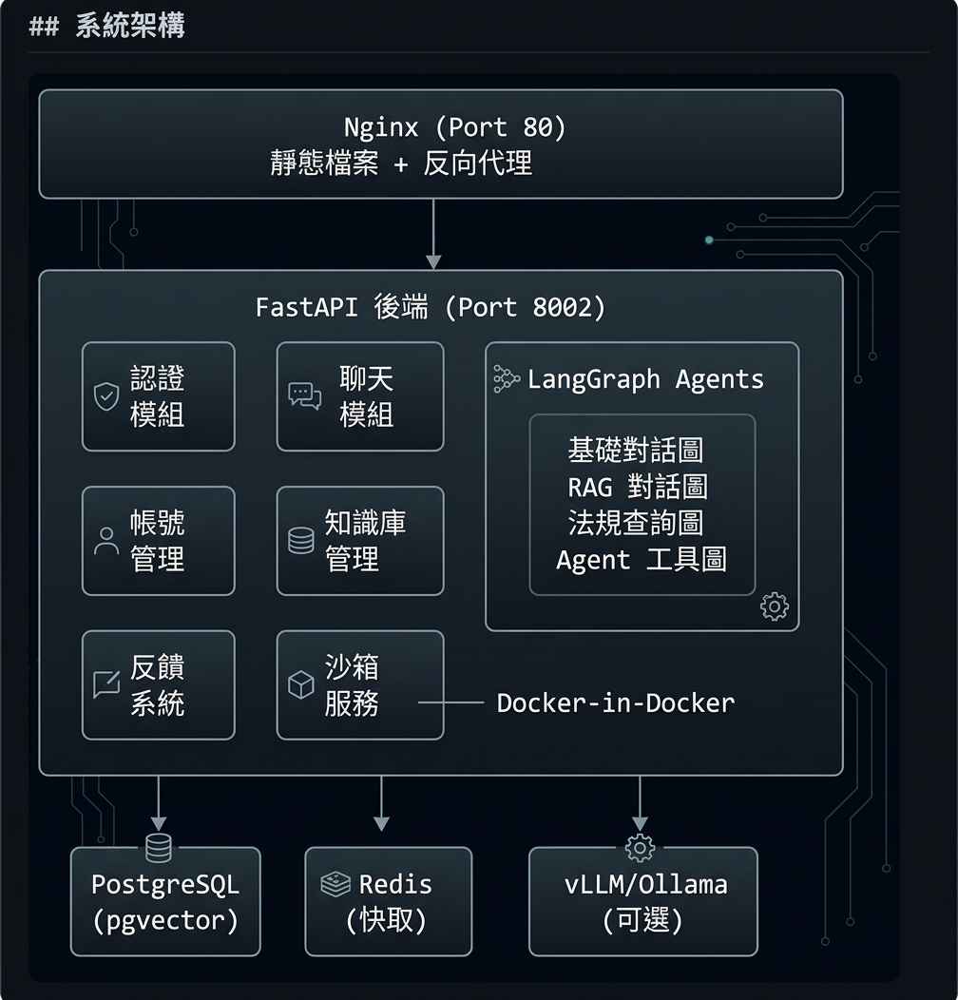
</p>

### 技術棧

| 層級 | 技術 |
|------|-----|
| **前端** | Vue 3、TypeScript、Vite、Naive UI、Tailwind CSS、Pinia |
| **後端** | Python、FastAPI、LangGraph 1.0、LangChain 1.0 |
| **資料庫** | PostgreSQL (pgvector)、Redis |
| **檢索** | BGE 嵌入模型、BM25、RRF 融合、BGE 重排序 |
| **推論** | vLLM、Ollama、OpenAI API、Azure OpenAI、Google Gemini |
| **部署** | Docker Compose、Nginx |
| **監控** | Grafana |

## 支援的 LLM

| 供應商 | 模型 | 本地/雲端 |
|-------|------|----------|
| **vLLM** | 任何 HuggingFace 模型（如 Qwen、Llama、Mistral） | 本地 |
| **Ollama** | 所有 Ollama 模型 | 本地 |
| **OpenAI** | GPT-4o、GPT-4、GPT-3.5 等 | 雲端 |
| **Azure OpenAI** | 所有 Azure 部署模型 | 雲端 |
| **Google Gemini** | Gemini 2.0 Flash、Gemini Pro 等 | 雲端 |

> 💡 **本地部署推薦：** 建議使用 **Qwen3.5** 搭配 **vLLM** 作為推論引擎，兼具效能與品質的最佳平衡。

## 開發路線圖

- [ ] i18n — 多語系介面支援（英文 / 中文）
- [ ] 更多 Agent 類型（深度研究、網路搜尋）
- [ ] 多租戶支援
- [ ] SSO 整合（LDAP、OAuth 2.0）
- [ ] API 金鑰管理
- [ ] 行動裝置優化介面

## 參與貢獻

歡迎貢獻！請參閱 [CONTRIBUTING.md](./CONTRIBUTING.md) 了解指引。

## 授權條款

本專案採用 [Apache License 2.0](./LICENSE) 授權。

---

<p align="center">
  如果你覺得 Metora 有幫助，請給我們一顆 ⭐
</p>

<p align="center">
  <a href="https://github.com/wuwushi4/metora/stargazers"></a>
</p>
